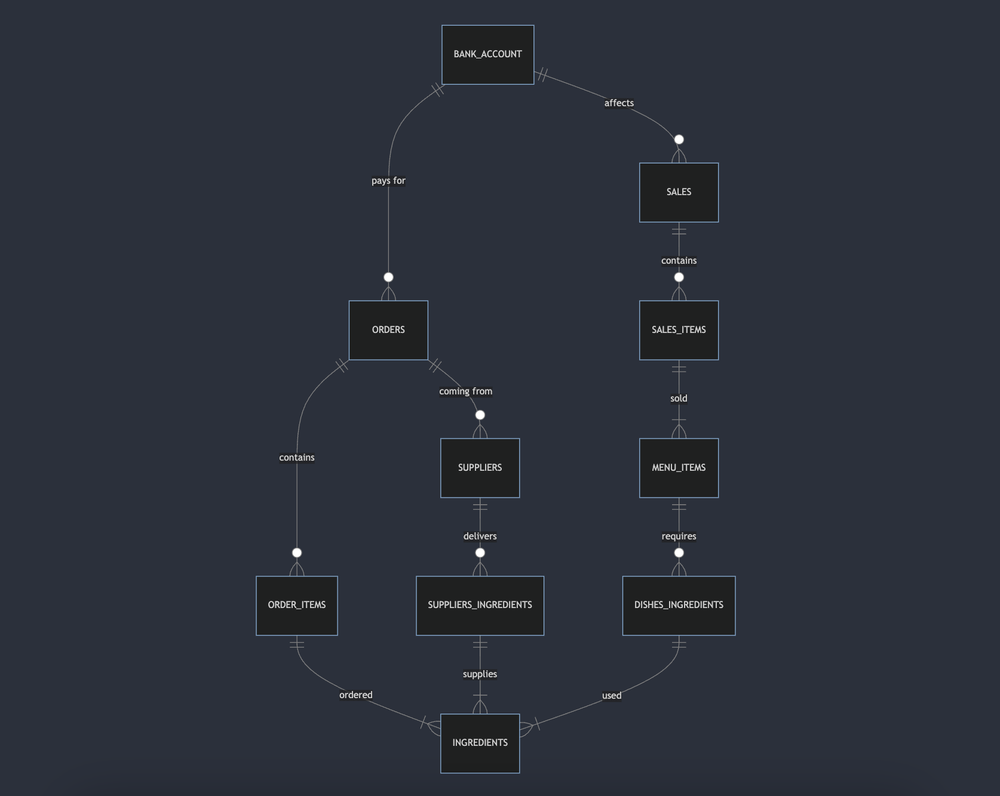

# Design Document

- Hospitality Management System
- Github: torwikari

## Scope

The Hospitality Management System includes all entities necessary to facilitate inventory tracking in a gastronomic enterprise. As such, included in the database's scope is:

- Bank account balance, including net cash and VAT due.
- Suppliers, including basic identifying information, contact details and delivery days.
- Ingredients, including price, UOM, inventory count and allergens.
- Menu items
- Orders to suppliers
- Product sales

- Out of scope are elements like Staff members, fixed costs, customer data (inc. feedback) and detailed sales data, taxes apart from VAT on sales.

## Functional Requirements

This database will support:

- Tracking all ingredients, menu items and suppliers including basic information about each.
- Stock control based to orders and sales.
- Bank account balances according to orders and sales.
- Sales will include VAT, which is added to a separate bank account.

- Note that in this iteration, the system will not support periodic stock-takes or accounting for daily operations stock variance like staff-food or wastage.

## Representation

Entities are captured in SQLite tables with the following schema:

#### Bank Account

The `bank_account` table includes:

- `id`, which specifies the unique ID for the bank account as an `INTEGER`. This column thus has the `PRIMARY KEY` constraint applied.
- `net_cash`, which specifies the free cash as `REAL`, given `REAL` is appropriate for float numbers fields.
- `vat_due`, which specifies the cash that's separated for VAT payment. `REAL` is used for the same reason as in `net_cash`.

All columns in the `bank_account` table are required and hence should have the `NOT NULL` constraint applied, the accounts are starting by `DEFAULT` with `0.0`. No other constraints are necessary.

#### Suppliers

The `suppliers` table includes:

- `id`, which specifies the unique ID for the supplier as an `INTEGER`. This column thus has the `PRIMARY KEY` constraint applied.
- `name`, which specifies the suppliers business name as `TEXT`.
- `category`, which specifies suppliers business category as `TEXT`.
- `contact_number`, which specifies suppliers business contact number as `INTEGER`.
- `contact_mail`, which specifies suppliers contact mail as `TEXT`.
- `delivery_days`, which specifies delivery days for a particular supplier as `TEXT`.

All columns in the `suppliers` table are required, and hence should have the `NOT NULL` constraint applied. No other constraints are necessary.

### Ingredients

The `ingredients` table includes:

Tracks ingredients used in the restaurant:

- `id`: which specifies the unique ID for the ingredient as an `INTEGER`. This column thus has the `PRIMARY KEY` constraint applied.
- `name`: Ingredient's name as `TEXT`.
- `category`: Ingredient category (e.g., vegetables, dairy) as `TEXT`.
- `inventory_count`: Current inventory count as `REAL`
- `allergens`: Any allergens associated with the ingredient as `TEXT`.

All columns in the `ingredients` table are required, except for `allergens`, and hence should have the `NOT NULL` constraint applied. The `inventory_count` starts by `DEFAULT` with `0.0`. No other constraints are necessary.

### Menu Items

Stores menu items:

- `id`: which specifies the unique ID for the menu item as an `INTEGER`. This column thus has the `PRIMARY KEY` constraint applied.
- `name`: Name of the menu item as `TEXT`.
- `price`: Price of the item as `REAL`.
- `type`: Type of item (food or beverage) as `TEXT`.
- `total_quantity_sold` Total quantity sold as an `INTEGER`.

All columns in the `menu_items` table are required, and hence should have the `NOT NULL` constraint applied. The `type` column has a constraint to ensure that it falls under either `food` or `beverage`. The `total_quantity_sold` starts with a `DEFAULT` value of `0` and is updated by the `update_total_quantity_sold` trigger.

### Orders

Records orders placed with suppliers:

- `id`: which specifies the unique ID for the order as an `INTEGER`. This column thus has the `PRIMARY KEY` constraint applied.
- `supplier_id`: The supplier from whom the order was placed as `INTEGER`. This column thus has the `FOREIGN KEY` constraint applied, referencing the `id` column in the `suppliers` table, which ensures that each order is linked to a supplier.
- `order_date`: The date when the order was made as `TIMESTAMP`.
- `total_value`: Total value of the order as `REAL`.

All columns in the `orders` table are required and hence should have the `NOT NULL` constraint applied. The `total_value` starts by `DEFAULT` with `0.0`. The submission `order_date` attribute defaults to the current timestamp when a new row is inserted.

### Sales

Logs sales transactions:

- `id`: which specifies the unique ID for the sale as an `INTEGER`. This column thus has the `PRIMARY KEY` constraint applied.

* `sale_date`: The date when the sale occurred as a `TIMESTAMP`

All columns in the `sales` table are required and hence should have the `NOT NULL` constraint applied. The submission `sale_date` attribute defaults to the current timestamp when a new row is inserted.

### Relationships

- **A supplier can provide zero or many ingredients**. A supplier might not have supplied any ingredients yet, or they could be supplying multiple ingredients. Each ingredient is linked to just one supplier so that it's clear where it comes from.

- **An ingredient can be used in zero or many menu items**. Some ingredients might not be used in any dishes, while others could be part of several menu items. Each menu item can have many ingredients, which is tracked through a separate table.

- **A menu item can be part of zero or many orders**. A menu item might not have been ordered yet, or it could be ordered many times. Each order is linked to one supplier, but a supplier can handle lots of orders.

- **An order includes one or more ingredients**. Every order must include at least one ingredient, but usually, it has several. Each ingredient in an order is connected to that specific order, keeping track of what’s ordered and where it comes from.

- **A sale can include one or more menu items**. Every sale includes at least one menu item, but it often has several. Each menu item in a sale is linked to that specific sale, which is managed through a table that tracks this information.

- **The bank account is updated by orders and sales**. The bank account balance might stay the same if nothing happens, or it can change with each order or sale. Each transaction affects the bank account, so all the money coming in or going out is tracked.

## Optimizations

Per the typical queries in `queries.sql`, it is common for users of the database to access the lists of ingredients, menu items and suppliers. For that reason, indexes are created on the `name` column from `INGREDIENTS`, `MENU_ITEMS` and `SUPPLIERS`tables.

### Triggers

In order to automate processes in the database, these are the triggers used across the schema:

- `validate_and_update_inventory_before_sale` gets triggered after `INSERT ON` command on `order_items` table in order to update the total value of the order with a supplier to keep track on spending in an simplified manner. It also updates the inventory count of in the `ingredients` table with quantities ordered and removes the cost of good from the net cash in `bank_account` table.
- `update_order_inventory_bank_account` gets triggered before `INSERT ON` command on `sales_items` table in order to ensure that there's enough ingredients in stock for a particular menu item to be sold. If not, it raises an error with a message "**Not enough inventory for sale**". If there is then it removes the appropriate quantity of ingredients from the stock.
- `update_after_sale` gets triggered after `INSERT ON` command on `sales_items` table in order to update the `bank_account` with net cash and vat due. It also updates the total quantity sold in the `menu_items` for the particular item sold in order to keep track of the best and worst sellers.

## Views

# Views Overview

The following views have been created in the Hospitality Management System to simplify data access and reporting. These views organize data to provide quick insights into various aspects of inventory, sales, and profitability.

- `ingredients_ordered`: Lists all ingredients, ordered by category and then by name. It includes details about the inventory count and any associated allergens.
- `orders_summary`: Summarizes all orders placed with suppliers, showing the order date, supplier name, and the total value of each order.
- `menu_items_availability`: Shows the number of possible servings available for each menu item based on the current inventory levels of the ingredients required for each dish.
- `menu_items_profit`: Calculates the profitability of each menu item, showing the selling price, cost of ingredients, and net gross profit. The profit margin percentage is also provided.
- `total_sales_value`: Provides the total sales value by summing the price of all menu items sold.
- `best_selling_food`: Identifies the best-selling food item by total quantity sold.

## Limitations

The current schema does not account for VAT on ingredients, assuming that all ingredients are VAT-free. It also does not allow for notes to explain why ingredients are manually removed from stock due to daily operations such as staff meals, wastage, or unforeseen circumstances.
